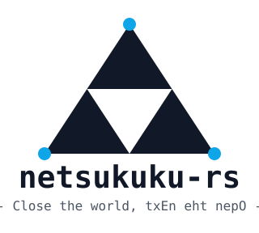

<p align="center">
  
</p>

# netsukuku-rs

--

A Rust reimplementation of [Netsukuku](https://github.com/Netsukuku/netsukuku)'s **current**
protocol stack: QSPN v2 routing, Neighborhood discovery, Identities, Hooking (network-merge
negotiation), Coordinator, the generic PeerServices DHT substrate, and ANDNA (distributed hostname
service).

> **Canonical home: [github.com/M0Rf30/netsukuku-rs](https://github.com/M0Rf30/netsukuku-rs)** —
> issues, pull requests, CI, and the crates.io release all live there. A read-only mirror is
> published at [codeberg.org/M0Rf30/netsukuku-rs](https://codeberg.org/M0Rf30/netsukuku-rs) for
> anyone who prefers a libre forge; it is a Forgejo *pull* mirror, so it tracks GitHub
> automatically and accepts no commits of its own.

## 1. The old wired

The Internet you are reading this on has a centre. Addresses come from a registry, names come from
a hierarchy of servers rooted in a handful of organizations, and a route exists because someone
with the authority to announce it did so. Take the registries and the roots away and the network
does not degrade — it stops meaning anything.

Netsukuku starts from the opposite premise: a routing protocol in which every node computes its own
address, resolves names peer-to-peer, and builds its own routes out of nothing but its neighbours,
with no server, no registry, and no root anywhere in the design. This repository is a from-scratch
Rust implementation of that protocol as it stands today, not as it stood in 2005.

"Current" is a deliberate word choice. Netsukuku has two upstream lineages and only one is a live
protocol spec:

- The **C daemon** (`netsukuku/netsukuku`) still implements the original 2005-2007 Npv7_HT design —
  fixed 256-way g-node fanout, combined "Radar" link-probing + "Hook & Unhook" merge logic, ad-hoc
  ANDNA hash-node placement, IP addressing/NAT done by shelling out to `ip`(8)/`iptables`(8). Its
  `doc/` tree has exactly one commit since 2013; all activity since is build/CI maintenance. It is a
  legacy compatibility target, not a spec source.
- The **Vala rewrite** (2017-2020, lukisi) is the modular respecification that actually changed the
  protocol: QSPN v2 (Extended Tracer Packets, per-level `gsize(i)` instead of fixed 256), a 3-way
  split of the old radar+hook logic into Neighborhood / Hooking / Coordinator, and PeerServices as a
  generic hierarchical DHT that ANDNA (and Coordinator) sit on top of instead of hand-rolled
  placement logic.

This repository ports the Vala design, not the C one. The archaeology backing that decision —
document-stratum dating, RFC-by-RFC adoption status, line-cited divergences — is in
[`research/notes/03-specs-and-rfcs.md`](research/notes/03-specs-and-rfcs.md).

## 2. Crate map

Twelve crates, dependency arrows point from dependent to dependency:

```
ntk-common  (Topology, Naddr, HCoord, Cost, Fingerprint — no deps on any sibling crate)
ntk-proto   (39-method wire schema + domain codec, prost/protox)                 -> ntk-common
ntk-rpc     (RpcClient/RpcHandler, TcpRpcClient, FakeRpcClient, TcpServer,
             UdpBroadcaster)                                                     -> ntk-proto
ntk-netlink (native netlink: RealNetlink, FakeNetlink, TableAllocator, detect,
             cleanup — no sibling deps, speaks std types only)
ntk-neighborhood (arc discovery, liveness, EMA cost + hysteresis)        -> ntk-common, ntk-proto,
                                                                              ntk-rpc, ntk-netlink
ntk-identities   (identity registry, duplication/migration handshake)   -> ntk-common, ntk-proto,
                                                                              ntk-rpc
ntk-qspn         (QSPN v2: ETP propagation, RouteSnapshot, eldership)    -> ntk-common, ntk-proto,
                                                                              ntk-rpc
ntk-peerservices (hierarchical DHT over the Naddr space, NTK_RFC 0014)   -> ntk-common, ntk-proto,
                                                                              ntk-rpc
ntk-hooking      (join/merge state machine, find_shortest_mig)          -> ntk-common, ntk-proto,
                                                                              ntk-rpc
                 (deliberately NOT ntk-qspn/identities/neighborhood/coordinator —
                  it defines its own QspnView/CoordinatorClient traits and the daemon
                  implements them, so hooking has no compile-time dependency on the
                  concrete routing/coordination stack)
ntk-coordinator  (CoordinatorService: PeerService, position reservation) -> ntk-common, ntk-proto,
                                                                              ntk-rpc, ntk-peerservices
ntk-andna        (hostname service, ed25519 ownership, two PeerServices
                  instances per RFC 0014)                                -> ntk-common, ntk-proto,
                                                                              ntk-rpc, ntk-peerservices
ntkd             (composition root: binary + lib, wires all eleven crates
                  into a running node)                                   -> all of the above
```

Exact dependencies (including feature flags) live in each crate's `Cargo.toml`; the above is the
shape, not a substitute for reading them.

## 3. Install

- **From source**: `cargo install ntkd` (crates.io) or `cargo build --release -p ntkd` from a
  checkout — see §4 for the full workspace toolchain commands.
- **Arch Linux**: `netsukuku-rs` (built from source) and `netsukuku-rs-bin` are maintained at
  [M0Rf30/PKGBUILD](https://github.com/M0Rf30/PKGBUILD).
- **OpenWrt**: `contrib/openwrt/net/netsukuku-rs/` is a standard package; add it as a feed
  (`contrib/openwrt/README.md` has the exact `feeds.conf` line and cross-compile notes).
- **Container**: multi-arch images at `ghcr.io/m0rf30/netsukuku-rs`; needs
  `--cap-add=NET_ADMIN --network host` at minimum (`contrib/container/README.md` explains why,
  and why UPX compression is applied on OpenWrt only, never here).

Every path ships the same `ntkd` binary; `crates/ntkd/README.md` documents its CLI once, shared
by all of them.

## 4. Build, test, run

Toolchain: `rust-version = "1.97"` (workspace floor); developed and CI-verified against `1.98.0`.

```sh
cargo build --workspace --all-targets
cargo test --workspace
cargo clippy --workspace --all-targets -- -D warnings
cargo fmt --all --check
```

`ntk-proto` and every module crate that defines RPC messages generate their prost code from
`.proto` sources **at build time** via `protox` (a pure-Rust protoc). No system `protoc` install is
required anywhere.

### Privileged test tier

536 tests pass in the `cargo test --workspace` run above. 24 more, across seven files, need real
kernel or root privileges and are `#[ignore]`d — not part of that run:

| File | Ignored | Needs |
|---|---|---|
| `crates/ntk-neighborhood/src/rtt.rs` | 1 | `CAP_NET_RAW` or `ping_group_range` (ICMP socket) |
| `crates/ntk-netlink/tests/real_netlink.rs` | 6 | `CAP_NET_ADMIN` |
| `crates/ntkd/tests/andna_e2e.rs` | 1 | `CAP_NET_ADMIN` over its own network namespaces |
| `crates/ntkd/tests/mesh.rs` | 7 | `CAP_NET_ADMIN` over its own network namespaces — **5 of these currently fail; see §6 Maturity** |
| `crates/ntkd/tests/multi_nic_relay.rs` | 1 | `CAP_NET_ADMIN` over its own network namespaces |
| `crates/ntkd/tests/multi_node.rs` | 2 | `CAP_NET_ADMIN` over its own network namespaces |
| `crates/ntkd/tests/wireless.rs` | 6 | `mac80211_hwsim` loaded; 5 of the 6 also need real root |

The five `CAP_NET_ADMIN`-over-netns files run rootlessly via `unshare --map-root-user` (an
unprivileged user+network namespace) on a host that allows unprivileged user namespaces:

```sh
unshare --net --map-root-user -- sh -c 'ip link set lo up; cargo test -p ntk-netlink -- --ignored'
unshare --net --map-root-user -- cargo test -p ntk-neighborhood --lib -- --ignored
unshare --net --map-root-user -- cargo test -p ntkd --test andna_e2e -- --ignored
unshare --net --map-root-user -- cargo test -p ntkd --test mesh -- --ignored
unshare --net --map-root-user -- cargo test -p ntkd --test multi_nic_relay -- --ignored
unshare --net --map-root-user -- cargo test -p ntkd --test multi_node -- --ignored
```

`multi_node.rs` (two real daemons, one hop) and `mesh.rs` (up to a 4-node chain — multi-hop
forwarding plus migration/partition regression coverage) read installed kernel routes back
through an *independent* `RealNetlink` connection to confirm the routes are real, not merely
computed in memory. `wireless.rs` needs `mac80211_hwsim` loaded first; one of its six tests is
read-only and needs no privilege at all, the other five need real root in `init_user_ns`
(`--map-root-user` is not enough for those):

```sh
cargo test -p ntkd --test wireless -- --ignored hwsim_radio_discovery_never_returns_the_real_radio
sudo cargo test -p ntkd --test wireless -- --ignored
```

See `.github/workflows/ci.yml` for why CI runs the privileged tier under `sudo` instead of
`--map-root-user` (GitHub-hosted runners restrict unprivileged user namespace creation by
default).

### Running a node

```sh
cargo run -p ntkd -- run --config <path/to/config.toml> [--nic eth0 ...] [--log-level info] [--status-socket /tmp/ntkd.sock]
cargo run -p ntkd -- status [--socket /tmp/ntkd.sock]
cargo run -p ntkd -- andna-register <hostname> [--socket /tmp/ntkd.sock]
cargo run -p ntkd -- andna-resolve <hostname> [--socket /tmp/ntkd.sock]
```

See `ntkd::kernel::config::NtkdConfig` for the config file shape (topology `gsizes`, `nics`,
port, `require_auth`) — read §6's security note before setting `require_auth = true`.

--

## 5. Load-bearing design decisions

- **L3 via netlink, never a TUN overlay.** Netsukuku is a real routing protocol: it owns kernel
  routing tables (multiple tables + policy rules via `ntk-netlink`'s `TableAllocator`), not an
  overlay network tunneled through a virtual interface. There is no TUN device anywhere in the
  workspace and no subprocess calls to `ip`/`iptables`/`sysctl` — `ntk-netlink` speaks netlink
  directly (`rtnetlink`) even in tests (`FakeNetlink` records the same operations `RealNetlink` would
  issue, so tests assert real intent, not real kernel state).
- **Single-owner actors, never `Arc<RwLock<_>>` over protocol state.** Each protocol module (QSPN,
  Neighborhood, Hooking, PeerServices, Identities, ANDNA, Coordinator) runs as one task owning its
  state exclusively; other code talks to it over `mpsc` command channels with `oneshot` replies,
  reads consistent point-in-time state via `tokio::sync::watch`, and observes state transitions via
  `broadcast` events. An outbound RPC is never awaited from inside a command loop — blocking the
  actor on a peer's response has caused two confirmed deadlocks in this codebase (`ntk-qspn`, and
  `ntkd`'s `LazyLinkClient`) and is treated as a standing defect class, not a one-off bug.
- **PeerServices is the substrate, ANDNA is a client of it.** Rather than ANDNA hand-rolling its own
  hash-node placement and anti-abuse bookkeeping (as the legacy C/RFC-0007 design does), ANDNA is
  built as two `PeerService` instances registered on the generic `ntk-peerservices` hierarchical DHT
  (NTK_RFC 0014). Coordinator is built the same way. This is a direct port of the Vala-era
  generalization, not a Rust-specific choice.
- **No transport crypto; authentication is opt-in at the application layer.** `ntk-rpc`'s
  `TcpRpcClient`/`TcpServer` speak the wire protocol in the clear — there is no TLS/Noise layer
  anywhere in the stack. What exists instead is ed25519 signing in `ntk-proto::auth`, over a
  domain-separated, length-framed canonical encoding: ANDNA hostname ownership, per-arc peer
  identity (pinned on first contact, as ANDNA pins a hostname's owner key), and a request's
  origin assertion, verified once at the servant rather than at every relay because verification
  costs ~26.8 µs against a 503 ns unauthenticated round trip. All of it is off by default
  (`require_auth = false`), so the default build stays a faithful reference: the `Auth` field is
  an optional protobuf field, which makes carrying it wire-compatible and only *enforcing* it a
  break.
- Anything that must be unique across the whole network — not just locally — derives from
  `ntk_neighborhood::NodeId`. Three separate bugs in this codebase came from treating a node-local
  value (an arc id, a link id) as if it were globally meaningful; `NodeId` is the one type that
  actually is.

## 6. What differs from the reference

**On parity.** The normative baseline for this port is Luca Dionisi's Vala rewrite, not the 2005
C daemon and not the full NTK_RFC wishlist. A four-domain audit (kernel routing, QSPN, ANDNA, and
g-node migration) re-read this section line-by-line against that baseline in 2026-08 and rejected
its previous claim of "exactly one" real gap. The corrected taxonomy below has four kinds of
divergence, not three — ANDNA's status is its own kind — so read the reason for each bullet, not
the count.

- *Not in the normative upstream either* — IPv6 (never implemented in any Netsukuku), and the
  unported Alpt-era RFC ideas: IGS (0003), bandwidth cost (0002), the counter-gnode pubkey fix
  (0007), Viphilama (0010), Carciofo (0011), Net Split (0012), Local ANDNA (0015).
  `research/notes/03-specs-and-rfcs.md` records that none of these has a found vala-era
  replacement.
- *Present in the legacy C daemon, deliberately dropped* — everything reachable only through
  `iptables`: the anonymizing address kind and `subnetlevel` (autonomous-subnet/NAT boundary) from
  the legacy addressing scheme. The legacy daemon implements both via `iptables -t nat` SNAT/
  NETMAP rules; porting them would mean either shelling out (rejected design choice, see §5) or
  adopting a native nftables/netlink NAT crate, which has not been evaluated. `ntk-netlink`'s
  address/route/rule types have no NAT concept. This follows from the no-subprocess rule, which
  is a purpose of this port, not an omission from it.
- *Upstream has nothing to port — this port went further instead* — ANDNA. `andna.vala` is a
  13-line stub (`AndnaManager.init` and nothing else — no registration, no resolution, no
  counter/anti-abuse logic) and `serializables.vala` for the module is empty. `ntk-andna`'s
  design is derived instead from the legacy C implementation (`andna.c`/`andna_cache.c`/
  `snsd_cache.c`) plus NTK_RFC 0009 (SNSD) and NTK_RFC 0014 (the DHT substrate). This is the
  fourth kind the old three-bucket framing excluded: not absent, not dropped, but built past what
  the reference itself has — which is why the security note below matters, not less.
- *A real gap against the reference* — four, not one:
  - **G-node migration is a full data-plane blackout for the whole window, not merely a missing
    second stack.** `rehook`/`migrate` tears down every kernel route the previous generation held
    before the successor identity exists (`crates/ntkd/src/node/lifecycle.rs:1298-1301`), and only
    reinstalls routes once the successor's own bootstrap reports complete (`:1373-1388`) — both
    destination traffic *to* this node and transit traffic *through* it are unreachable for the
    entire gap. Bounded, not unbounded: `QspnConfig::bootstrap_fallback_max_wait` caps the wait
    at 10s even with no qualifying peer ETP (`crates/ntk-qspn/src/config.rs:151`). Upstream
    avoids the blackout with connectivity identities — a bridge keeping the migrating g-node's
    external arcs alive while the guest re-hooks concurrently
    (`research/impl/vala/identities/identities.vala:441-577`) — which this daemon cannot build
    today because it holds one live dispatcher target per process, never two identities
    simultaneously reachable (`crates/ntkd/src/node/lifecycle.rs:137-149`).
  - **The Coordinator's migration hand-off is implemented and never used.**
    `ntk_coordinator::Manager::new` accepts a `handoff: Option<HandOff>`
    (`crates/ntk-coordinator/src/actor.rs:383`) and `Handle::hand_off` exports a generation's
    state for exactly that purpose (`:512-517`), but the one call site that constructs a
    `Manager` hardcodes `None` (`crates/ntkd/src/node/services.rs:217`). Per-level eldership and
    reservation state (`GnodeMemory::fresh`, `actor.rs:389`) restarts from scratch on every rehook
    instead of carrying forward.
  - **No preflight for a host that already uses `10.0.0.0/8`.**
    `crates/ntkd/src/kernel/preflight.rs` checks kernel routing capabilities and configured-NIC
    existence (`:18-65`) but nothing checks whether the address space this daemon unconditionally
    claims (`crates/ntkd/src/kernel/addressing.rs:1-2`) is already in use by something else on the
    host — Docker's default bridge, a corporate VPN, or (on the machine this audit ran on)
    `tailscale0`/`wg0`. A collision is silently possible, not merely undocumented.
  - **ANDNA's Counter anti-Sybil cap (NTK_RFC 0007) is fully bypassable under the default
    `require_auth = false`.** The cap keys reservations by the requester's `client_tuple`
    (`crates/ntk-andna/src/counter.rs:12-14`), tamper-proof only when origin-auth is enforced —
    which it isn't by default (`crates/ntk-peerservices/src/actor.rs:834-841`,
    `crates/ntkd/src/kernel/config.rs:49-50`). A security property, not a scope cut — the note
    directly below explains why, and why the default can't simply change.

### Security default: hostname registration has no anti-Sybil enforcement

ANDNA's Counter service caps live hostname reservations per registrant (NTK_RFC 0007) by keying
them to the requester's `client_tuple` — its position as `ntk-peerservices`' own routing resolved
it, supposedly not a value the requester can just declare (`crates/ntk-andna/src/counter.rs:12-14`,
`crates/ntk-andna/proto/andna.proto:108-110`). That is only true when the request's origin is
authenticated. `client_tuple` travels end-to-end through relays inside
`PeerMessageForwarder::n`, and only an origin-auth signature
(`crates/ntk-peerservices/src/origin_auth.rs`) stops a relay — or the requester itself — from
claiming any position it likes. Verifying that signature is a no-op when `Config::require_auth`
is `false` (`crates/ntk-peerservices/src/actor.rs:834-841`), and `false` is the default:
`NtkdConfig::require_auth` is `#[serde(default)]` (`crates/ntkd/src/kernel/config.rs:49-50`).
That default is not an oversight — the wire `Auth` field is optional precisely so a node that
doesn't set it stays interoperable with one that does (`crates/ntkd/src/kernel/config.rs:114-117`);
*enforcing* it, not carrying it, is what would break interop. The practical consequence: on a
default node, the Counter cap is enforced against whatever `client_tuple` a caller sends, which
is exactly the self-declared, spoofable value `counter.rs`'s own doc comment says it deliberately
is not. Set `require_auth = true` with a configured `node_key_path` for the cap to mean anything
against a hostile peer; the default build does not give you that protection.

Two more defects this same audit found — a route-installer state desync that could wedge kernel
routing permanently, and a missing bootstrap-phase gate letting a still-hooking node inject
premature routing state into the network — were real gaps too, until this release: both are
fixed in 0.1.3 (`CHANGELOG.md`), not carried in the list above.

**Maturity.** 536 unit/property tests pass in the default `cargo test --workspace` run; 24 more
are `#[ignore]`d because they need real kernel/root privileges (§4 lists all seven files and
their invocations). Two real `ntkd` daemons, each in its own network namespace joined by a real
veth pair, do register and resolve an ANDNA hostname across that network —
`hostname_registered_on_one_real_daemon_resolves_from_a_different_real_daemon`
(`crates/ntkd/tests/andna_e2e.rs`) passes in 0.36s run under `unshare --net --map-root-user`.
`multi_node` (2 tests) and `multi_nic_relay` (1) also pass there.

**But `crates/ntkd/tests/mesh.rs` does not.** Run serially under
`unshare --net --map-root-user -- cargo test -p ntkd --test mesh -- --ignored --test-threads=1`,
it reports 2 passed / 5 failed in ~500s. Four fail deterministically across repeated runs:
`partition_clean_severance_drops_exactly_the_unreachable_destinations`,
`partition_signals_split_only_after_the_documented_debounce`,
`two_level_gnode_migrates_as_a_unit_into_merged_network`, and
`two_star_groups_merge_into_one_network` — that is partition detection, g-node migration, and
network merge, i.e. the protocol's least-exercised and highest-consequence paths. Two more
(`chain_of_four_converges_to_exact_multi_hop_routes`,
`level1_destination_installs_correct_cidr_route`) are flaky: they swap pass/fail between
otherwise identical runs. Only `isolated_merge_migrates_a_preformed_losing_gnode_as_a_unit`
passes reliably.

These failures predate 0.1.3 — verified by re-running the same suite with this release's two
fixes stashed out, which produces the same 2/5 split. They are invisible in CI because the whole
tier is `#[ignore]`d and the privileged CI job has never been observed to pass (`AGENTS.md`).
They are left red rather than weakened, per this project's convention, and are not yet diagnosed.

So: the single-process and two-node paths are tested and pass; multi-hop convergence, partition,
migration, and merge are **not** demonstrated to work on a real kernel. No deployment beyond the
test harness has been run. This is not battle-tested, and §6's gap list is a floor, not a
ceiling.

## 7. Research corpus

[`research/README.md`](research/README.md) indexes the reference material this port was built
against, plus the exact clone list needed to restore it. `research/notes/` (our own synthesis,
with `path:line` citations into the vendored sources) is committed. The vendored upstream clones
themselves — `research/impl/` (18 Vala repos plus the pinned C daemon), `research/related/`,
`research/papers/`, `research/specs/` — are gitignored: third-party, large (21 MB for all 18
Vala clones combined, 124 MB for the C daemon's full pinned history), and regenerable, not source
material this project owns. `research/README.md`'s own "Clone list" section gives the exact
commands — a `git clone --depth 1` per repo for `impl/vala/` and `related/`, a full clone pinned
to `886a24a` for `impl/c/netsukuku`, and the URLs `specs/`/`papers/` are derived from. That list
did not exist before this audit restored it: a fresh clone before 2026-08-27 had no way to
regenerate the corpus at all, despite this section's previous claim that it did.

**A fresh clone will not resolve `research/impl/vala/<path>:<line>` citations** until that
restore step runs — every doc comment in this workspace citing one is citing this machine's local
corpus, not something packaged with the crate or committed to git history (`AGENTS.md` already
warns about this; this README didn't, until now).

Two notes worth reading first: `research/notes/01-vala-core-routing.md` (§3 QSPN, §6-7 Hooking and
Coordinator) and `research/notes/02-vala-services-daemon.md` (§3 PeerServices, §5 the daemon).

--

## Credits

The protocol this repository implements is not ours. It was designed by Andrea Lo Pumo (AlpT) and
the community around the **Freaknet Medialab**, Catania, Italy, <www.freaknet.org>, together with
the **Poetry Hacklab**. The modular respecification this port actually follows — QSPN v2,
Neighborhood / Hooking / Coordinator, PeerServices as a generic substrate — is Luca Dionisi's
(lukisi) Vala rewrite; it is the normative source for this codebase, cited throughout
`research/notes/`.

This is a Rust implementation of their protocol, tested and built independently; any defect in it
is ours, not theirs.

## License

GPL-3.0-or-later, matching the upstream Netsukuku lineage. See [`LICENSE`](LICENSE).
